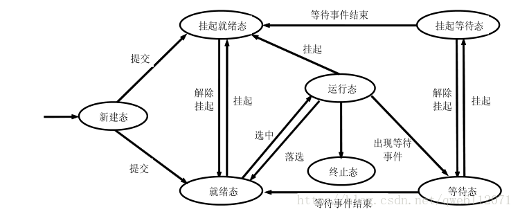
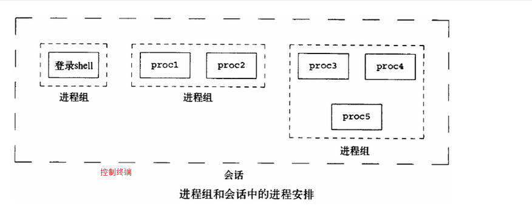

# **OS**

## **进程与线程**
### **概念**
* 进程：是并发执行的程序在执行过程中分配和管理资源的基本单位，是一个动态概念，竞争计算机系统资源的基本单位。  
* 线程：是进程的一个执行单元，是进程内科调度实体。比进程更小的独立运行的基本单位。线程也被称为轻量级进程。  
  
### **区别**
* 地址空间：同一进程的线程共享本进程的地址空间，而进程之间则是独立的地址空间。  
* 资源拥有：同一进程内的线程共享本进程的资源如内存、I/O、cpu等，但是进程之间的资源是独立的。
* 执行过程：每个独立的进程程有一个程序运行的入口、顺序执行序列和程序入口。但是线程不能独立执行，必须依存在应用程序中，由应用程序提供多个线程执行控制。
* 线程是处理器调度的基本单位，但是进程不是。
* 两者均可并发执行。
### **优缺点**
* 线程执行开销小，但是不利于资源的管理和保护。线程适合在SMP机器（双CPU系统）上运行。
* 进程执行开销大，但是能够很好的进行资源管理和保护。进程可以跨机器前移。

## **进程的状态转换**
### **七态模型描述**

1. 运行态(running):占有处理器正在运行 
2. 就绪态(ready):具备运行条件，等待系统分配处理器以便运行 
3. 等待态(blocked):不具备运行条件，正在等待某个事件的完成

### **进程的挂起**
1. 系统中的进程均处于等待状态，处理器空闲，此时需要把一些阻塞进程对换出去，以腾出足够的内存装入就绪进程运行。 
2. 进程竞争资源，导致系统资源不足，负荷过重，此时需要挂起部分进程以调整系统负荷 ,保证系统的实时性或让系统正常运行。 
3. 把一些定期执行的进程（如审计程序、监控程序、记账程序）对换出去，以减轻系统负荷。 
4. 用户要求挂起自己的进程，以便根据中间执行情况和中间结果进行某些调试、检查和改正。 
5. 父进程要求挂起自己的后代进程，以进行某些检查和改正。 
6. 操作系统需要挂起某些进程，检查运行中资源使用情况，以改善系统性能;或当系统出现故障或某些功能受到破坏时，需要挂起某些进程以排除故障。  
   
**挂起就绪态（ready,suspend）**  
挂起就绪态表明了进程具备运行条件但目前在二级存储器中，只有当它被对换到主存才能被调度执行  
**挂起等待态（blocked,suspend）**  
挂起等待态则表明了进程正在等待某一个事件且在二级存储器中。

### **进程转换的具体原因**
* **等待态—→挂起等待态**：如果当前不存在就绪进程，那么至少有一个等待态进程将被对换出去成为挂起等待态；操作系统根据当前资源状况和性能要求，可以决定把等待态进程对换出去成为挂起等待态。  
* **挂起等待态—→挂起就绪态**：引起进程等待的事件发生之后，相应的挂起等待态进程将转换为挂起就绪态。
* **挂起就绪态—→就绪态**：当内存中没有就绪态进程，或者挂起就绪态进程具有比就绪态进程更高的优先级，系统将把挂起就绪态进程转换成就绪态。  
* **就绪态—→挂起就绪态**：操作系统根据当前资源状况和性能要求，也可以决定把就绪态进程对换出去成为挂起就绪态。
* **挂起等待态—→等待态**：当一个进程等待一个事件时，原则上不需要把它调入内存。但是在下面一种情况下，这一状态变化是可能的。当一个进程退出后，主存已经有了一大块自由空间,而某个挂起等待态进程具有较高的优先级并且操作系统已经得知导致它阻塞的事件即将结束，此时便发生了这一状态变化。
* **运行态—→挂起就绪态**：当一个具有较高优先级的挂起等待态进程的等待事件结束后，它需要抢占 CPU，，而此时主存空间不够，从而可能导致正在运行的进程转化为挂起就绪态。另外处于运行态的进程也可以自己挂起自己。
* **新建态—→挂起就绪态**：考虑到系统当前资源状况和性能要求，可以决定新建的进程将被对换出去成为挂起就绪态。

## **守护进程**
### **什么是Linux下的守护进程**  
Linux daemon是运行于后台常驻内存的一种特殊进程，周期性的执行或者等待trigger执行某个任务，与用户交互断开，独立于控制终端。一个守护进程的父进程是init进程，它是一个孤儿进程，没有控制终端，所以任何输出，无论是向标准输出设备stdout还是标准出错设备stderr的输出都被丢到了/dev/null中。守护进程一般用作服务器进程，如httpd，syslogd等。

### **进程，进程组，会话，控制终端之间的关系**  

* 进程组:它是由一个或多个进程组成，进程组号(GID)就是这些进程中的进程组长的PID。
* 会话:其实叫做会话期(session)，它包括了期间所有的进程组，一般一个会话期开始于用户login，一般login的是shell终端，所以shell终端又是此次会话期的首进程，会话一般结束于logout。对于非进程组长，它可以调用setsid()创建一个新的会话。
* 控制终端(tty):一般就是指shell终端，它在会话期中可有也可以没有。

### 守护进程的创建
```
void mydaemon(void)
{    
    pid_t pid;
    int fd, i, nfiles;
    struct rlimit rl;

    pid = fork();
    if(pid < 0)
        ERROR_EXIT("First fork failed!");

    if(pid > 0)
        exit(EXIT_SUCCESS);// father exit

    if(setsid() == -1)
        ERROR_EXIT("setsid failed!");

    pid = fork();
    if(pid < 0)
        ERROR_EXIT("Second fork failed!");

    if(pid > 0)// father exit
        exit(EXIT_SUCCESS);
    #ifdef RLIMIT_NOFILE
    /* 关闭从父进程继承来的文件描述符 */
    if (getrlimit(RLIMIT_NOFILE, &rl) == -1)
        ERROR_EXIT("getrlimit failed!");
    nfiles = rl.rlim_cur = rl.rlim_max;
    setrlimit(RLIMIT_NOFILE, &rl);
    for(i=3; i<nfiles; i++)
        close(i);
　　 #endif
    /* 重定向标准的3个文件描述符 */
    if(fd = open("/dev/null", O_RDWR) < 0)
        ERROR_EXIT("open /dev/null failed!");
    for(i=0; i<3; i++)
        dup2(fd, i);
　　 if(fd > 2) close(fd);
    /* 改变工作目录和文件掩码常量 */
    chdir("/");
    umask(0);
}
```
* **A(7~12行):成为后台进程**   
  用fork创建子进程，父进程退出，子进程成为孤儿进程被init接管，子进程变为后台进程。
* **B(14~15行):脱离父进程的控制终端，登陆会话和进程组**  
  调用setsid()让子进程成为新会话的组长，脱离父进程的会话期。setsid()在调用者是某进程组组长时会失败，但是A已经保证了子进程不会是组长，B之后子进程变成了新会话组的组长。
* **C(17~22行):禁止进程重新开启控制终端**  
  因为会话组的组长有权限重新打开控制终端，所以这里第二次fork将子进程结束，留着孙进程，孙进程不是会话组的组长所以没有权利再打开控制终端，这样整个程序就与控制终端隔离了。
* **D(23~31行):关闭文件描述符**  
  进程从创建它的父进程那里继承了打开的文件描述符。如不关闭，将会浪费系统资源，造成进程所在的文件系统无法卸下以及引起无法预料的错误。
* **E(32~36行):重定向0,1,2标准文件描述符**  
  将三个标准文件描述符定向到/dev/null中
* **F(38~40行):改变工作目录和文件掩码**
  进程活动时，其工作目录所在的文件系统不能卸下(比如工作目录在一个NFS中,运行一个daemon会导致umount无法成功)。一般需要将工作目录改变到根目录。对于需要转储核心，写运行日志的进程将工作目录改变到特定目录如chdir("/tmp")，进程从创建它的父进程那里继承了文件创建掩模。它可能修改守护进程所创建的文件的存取位。为防止这一点，将文件创建掩模清除：umask(0);